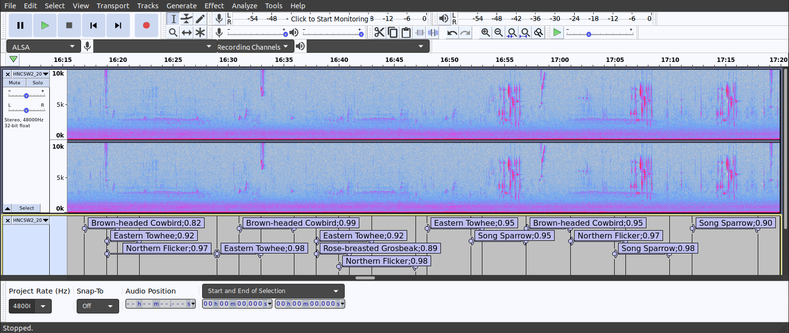

## THIS REPOSITORY IS OBSOLETE AND NO LONGER MAINTAINED.
## THE ACTIVE REPOSITORY IS https://github.com/jhuus/HawkEars

## Introduction
HawkEars is a desktop program that scans audio recordings for bird sounds and generates [Audacity](https://www.audacityteam.org/) label files. It is inspired by [BirdNET](https://github.com/kahst/BirdNET), and intended as an improved productivity tool for analyzing field recordings. This repository includes the source code and a trained model for a list of species found in Canada. The complete list is found [here](https://github.com/jhuus/HawkEars/blob/main/data/classes.txt). The repository does not include the raw data or spectrograms used to train the model.

This project is licensed under the terms of the MIT license.

## Installation

To install HawkEars on Linux or Windows:

1.	Install [Python 3](https://www.python.org/downloads/), if you do not already have it installed.
2.	Download a copy of this repository. If you have Git installed, type:

```
 git clone https://github.com/jhuus/HawkEars
```

Otherwise you can click on the Code link at the top, select “Download ZIP” and unzip it after it’s been downloaded.

3.	Install required Python libraries:

```
pip install -r requirements.txt
```

4.	Install ffmpeg. On Linux, type:

```
sudo apt install ffmpeg
```

On Windows, download [this zip file](https://www.gyan.dev/ffmpeg/builds/ffmpeg-release-essentials.zip), then unzip it, move it somewhere and add the bin directory to your path. For instance, you could move it to "C:\Program Files\ffmpeg", and then add "C:\Program Files\ffmpeg\bin" to your path by opening Settings, entering "Environment Variables" in the "Find a Setting" box, clicking the Environment Variables button, selecting Path, clicking Edit and adding "C:\Program Files\ffmpeg\bin" at the bottom (without the quotes).

5. If you have a [CUDA-compatible NVIDIA GPU](https://developer.nvidia.com/cuda-gpus), such as a Geforce RTX, you can gain about a 20% performance improvement in analysis by installing [CUDA](https://docs.nvidia.com/cuda/). Be sure to select a [compatible version](https://www.tensorflow.org/install/source#gpu) (e.g. CUDA 11.2 with Tensorflow 2.7). Also, read the installation instructions carefully, since additional steps are needed after running the installer.

6. If you plan to train your own models, you will need to install SQLite. On Windows, follow [these instructions](https://www.sqlitetutorial.net/download-install-sqlite/). On Linux, type:

```
sudo apt install sqlite3
```

## Analyzing Field Recordings
To run analysis, type:

```
python analyze.py -i <input path> -o <output path>
```

The input path can be a directory or a reference to a single audio file, but the output path must be a directory, where the generated Audacity label files will be stored. As a quick first test, try:

```
python analyze.py -i test -o test
```

This will analyze the recording(s) included in the test directory. There are also a number of optional arguments, which you can review by typing:

```
python analyze.py -h
```

If you don't have access to additional recordings for testing, one good source is [xeno-canto](https://xeno-canto.org/). Recordings there are generally single-species, however, and therefore somewhat limited. A source of true field recordings, generally with multiple species, is the [Hamilton Bioacoustics Field Recordings](https://archive.org/details/hamiltonbioacousticsfieldrecordings).

After running analysis, you can view the output by opening an audio file in Audacity, clicking File / Import / Labels and selecting the generated label file. Audacity should then look something like this:



The numeric suffix on each label is a confidence level, which is not the same as a statistical probability.

To show spectrograms by default in Audacity, click Edit / Preferences / Tracks and set Default View Mode = Spectrogram. You can modify the spectrogram settings under Edit / Preferences / Tracks / Spectrograms.

You can click a label to view or listen to that segment. You can also edit a label if a bird is misidentified, or delete and insert labels, and then export the edited label file for use as input to another process. Label files are simple text files and easy to process for data analysis purposes.

## Limitations
Some bird species are difficult to identify by sound alone. This includes mimics, for obvious reasons, which is why Northern Mockingbird is not currently included in the species list. European Starlings are included, but often mimic other birds and are therefore sometimes challenging to identify. Species that have been excluded because they sound too much like other species are Hoary Redpoll (sounds like Common Redpoll) and Philadelphia Vireo (sounds like Red-eyed Vireo).

The current list is missing a number of species, especially shorebirds and waterfowl, so adding species is another future task. Also, it's missing sound types for many species. For example, juvenile begging sounds are mostly missing. That's partly due to difficulty getting enough good recordings of these sounds, but it's certainly an area for further work.

## Training Your Own Model
Setting up your own model mostly consists of finding good recordings, selecting segments within the recordings, and converting them to spectrograms stored in a SQLite database (see Implementation Notes below). Model training is performed by train.py. To see available parameters, type:

```
python train.py -h
```

If this is something you want to do, and you would like some help, please contact me, e.g. by posting an issue to this repository.

## Implementation Notes
### Neural Networks
HawkEars uses an ensemble of two neural networks: one to detect low frequency noise during spectrogram creation, and one to identify bird species. Both are based on the EfficientNetV2 design introduced in [this paper](https://arxiv.org/abs/2104.00298). It is an image-classification network, trained on spectrogram images. The implementation is in model/efficientnet_v2.py.

### Spectrograms
Spectrograms are extracted from audio files in core/audio.py, then compressed and saved to a SQLite database.

(more content required here)
